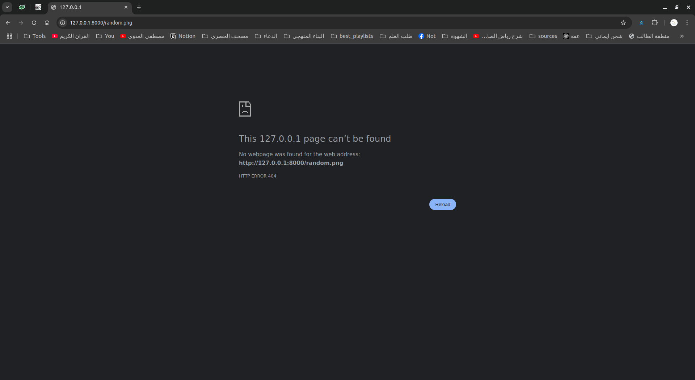
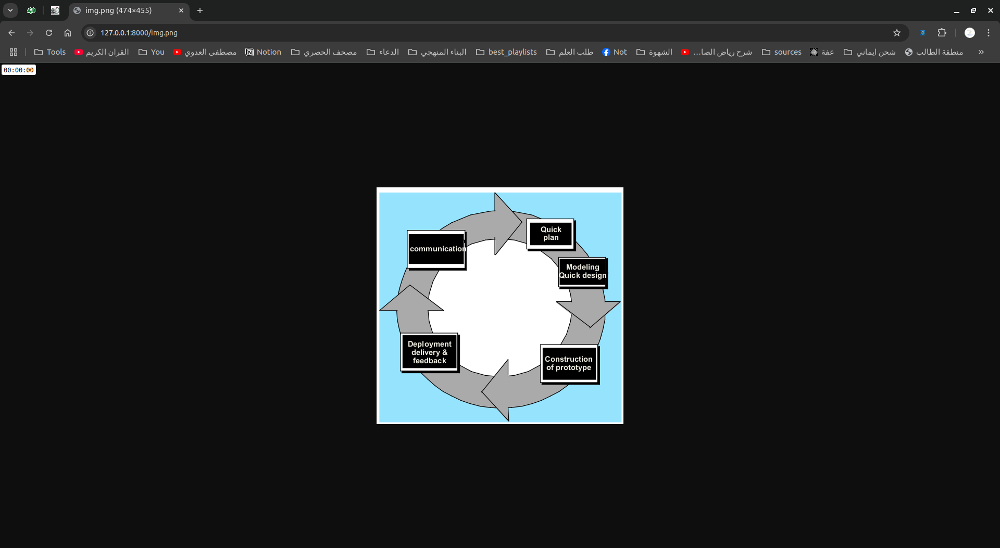
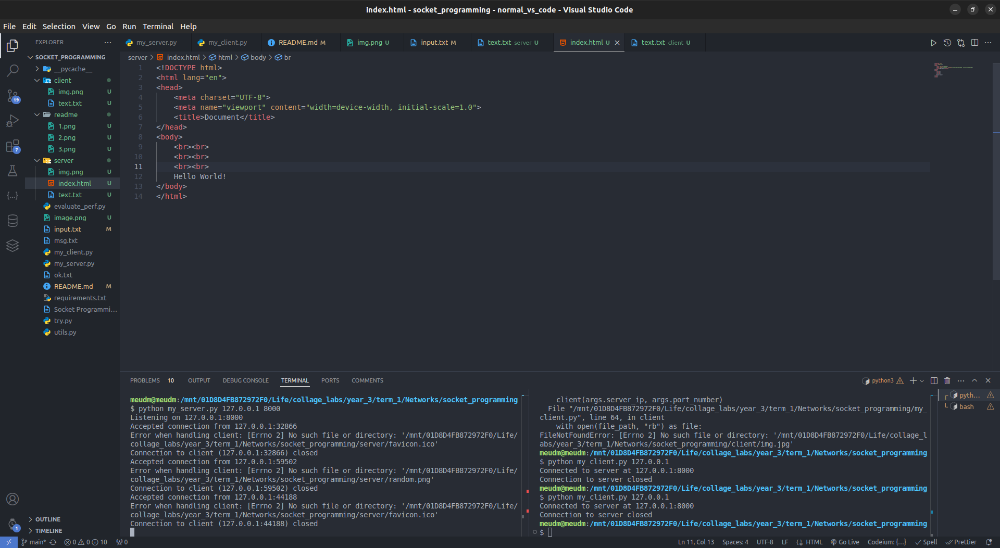
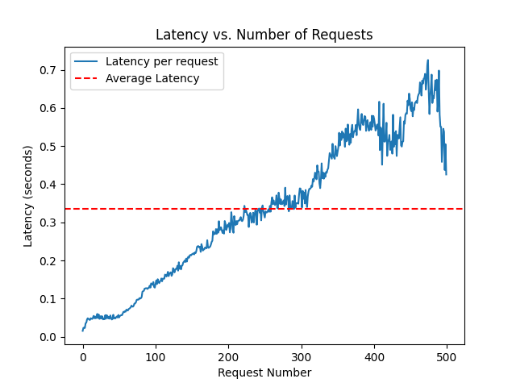

# Descirption

- This project is a simple implementation of a TCP server and client in Python. The server listens for incoming connections and when a client connects, it sends a file to the client. The client receives the file and saves it locally.

- Supports images, plain text, and HTML files.

- The server listens for incoming connections on a specified IP address and port. When a client connects, it sends a welcome message, and then listens for commands from the client. The client can send either a GET or POST request. If the request is a GET request, the server sends the file to the client. If the request is a POST request, the server saves the file sent by the client.

- The client reads commands from an input file. The commands are either `client_post <file_name> <server_ip> <port_number>` or `client_get <file_name> <server_ip> <port_number>`. The client sends a POST or GET request to the server based on the command.

# Installion

1. **Clone the Repository**  
   Clone the repository to your local machine using the following command:
   ```bash
   git clone https://github.com/Mohamed-Mohamed-Ibrahim/socket_programming
   ```

2. **Navigate to the Project Directory**  
   Change your directory to the project folder:
   ```bash
   cd Socket-Programming
   ```

3. **Install Required Dependencies**  
   Use `pip` to install the necessary dependencies:
   ```bash
   pip install -r requirements.txt
   ```

4. **Run the Server**  
   Start the server by running the following command, replacing `<server_ip>` and `<port_number>` with your desired IP address and port number:
   ```bash
   python my_server.py <server_ip> <port_number>
   ```
5. **Run the Client**  
   Start the client by running the following command, replacing `<server_ip>` and `<port_number>`  with your desired IP address and port number:
   ```bash
   python my_client.py <server_ip> <port_number>
   ```

# Usage

1. **Run the Server**   
    ```bash
    python my_server.py 127.0.0.1 8000
    ```
2. **Run the Client**
    ```bash
    python my_client.py 127.0.0.1 8000
    ```

# Bouns Part

1. Test your server with a real web browser
   - 404 Not Found
      
   - 200 OK
      
   - trying html
      
      
2. Performance Evaluation

   

# Client Code Explained

This Python code implements a simple HTTP client that reads commands from a file, sends HTTP requests to a server, and processes the server's response.

## Key Components

### Imports and Utilities:
- **`socket`**: Used for network communication to establish a connection with the server.
- **`argparse`**: Handles command-line argument parsing to accept `server_ip` and `port_number`.
- **`utils`**: A custom module that is imported, but its exact content is not shown in the provided code. It likely contains helper functions such as `get_content_type`.

### Core Functions

1. **`prepare_get_message`**:
   - Builds the HTTP `GET` request string.
   - Parameters: `file_path`, `server_address`, `connection_type` (default is `keep-alive`), `server_port` (default is 8000).
   - Returns a formatted `GET` request message to be sent to the server.

2. **`prepare_post_message`**:
   - Builds the HTTP `POST` request string, including headers like `Content-Type` and `Content-Length`.
   - Parameters: `file_path`, `server_address`, `data_len`, `connection_type` (default is `keep-alive`), `content_type` (default is `text/plain`), `server_port` (default is 8000).
   - Returns a formatted `POST` request message to be sent to the server.

3. **`parse_command`**:
   - Parses a command string (from an input file).
   - Extracts the HTTP operation (`GET` or `POST`), file path, host name, and optional port number (defaults to 8000).
   - Returns the parsed components: `operation`, `file_path`, `host_name`, and `port_number`.

4. **`client`**:
   - Main function that handles the client-server interaction.
   - Prompts the user for a file path containing commands, creates a TCP socket, and connects to the server.
   - Reads commands from the input file and processes each command.
   - Sends the appropriate HTTP request (`GET` or `POST`) based on the command.

### Client Workflow

1. **Socket Creation and Connection**:
   - The client creates a TCP socket using `socket.socket()` and connects to the server with the provided `server_ip` and `port_number`.

2. **Command Processing**:
   - The client reads commands from an input file:
     - If the command is `client_get`, it prepares and sends a `GET` request.
     - If the command is `client_post`, it reads the content from the specified file and sends a `POST` request.

3. **Response Handling**:
   - After sending a request, the client waits for the server's response:
     - The response is read in chunks (4096 bytes at a time).
     - If the `Content-Length` header is present, the client reads the specified number of bytes.
     - If the response is a file (e.g., image), the client writes the response data in binary mode. Otherwise, it writes in text mode.

4. **Close Connection**:
   - After processing all commands and receiving responses, the client closes the socket connection using `client.close()`.

### Command-line Interface

In the `__main__` block:
- **`argparse`** is used to parse the command-line arguments: `server_ip` and `port_number`.
- The `client()` function is then called with the parsed `server_ip` and `port_number` as parameters.


# Server Code Explained

# Multi-threaded HTTP Server

This code implements a multi-threaded HTTP server that handles `GET` and `POST` requests, with dynamic timeout adjustment based on server load.

## Key Components:

### 1. **Imports and Utilities**:
   * `socket` for network communication.
   * `threading` for handling multiple client connections in parallel.
   * `argparse` for parsing command-line arguments.
   * `ThreadPoolExecutor` from `concurrent.futures` to manage worker threads.

### 2. **Timeout Calculation**:
   * **`calculate_timeout`**: Adjusts the timeout for client connections based on the number of available worker threads. As the server load increases, the timeout is reduced.

### 3. **HTTP Response Preparation**:
   * **`prepare_get_response_found`**: Prepares a `200 OK` HTTP response with content length and connection type.
   * **`prepare_get_response_not_found`**: Prepares a `404 Not Found` response when the requested resource is unavailable.
   * **`prepare_post_response`**: Prepares a `200 OK` response for successful `POST` requests.

### 4. **Request Handling**:
   * **`handle_client`**: Processes incoming requests from clients.
     * For `GET` requests, it reads the requested file and sends it back to the client.
     * For `POST` requests, it saves the received data to the specified file.
     * It handles reading the request in chunks and checks for the `Content-Length` header to process large payloads.

### 5. **Server Operation**:
   * **`run_server`**: Binds the server to the specified IP and port, listens for client connections, and assigns client handling to separate threads.
   * It calculates the timeout for each connection based on server load (number of available worker threads).

### 6. **Threading**:
   * **ThreadPoolExecutor** manages worker threads, and new threads are created to handle each incoming client connection.

## Workflow:

1. **Server Initialization**:
   * The server binds to a specific IP and port, starts listening for incoming connections, and uses a thread pool to handle each client.
   
2. **Request Handling**:
   * For each request, the server checks if it is `GET` or `POST`:
     * For `GET`: It reads the requested file and returns it.
     * For `POST`: It writes the received data to a file.
   
3. **Connection Timeout**:
   * The timeout for client connections is dynamically adjusted based on server load.

4. **Shutdown**:
   * The server closes the connection once the request has been processed.

## Command-line Interface:

* **`argparse`** is used to parse the server's IP address and port number from the command line.
* The `run_server()` function is called with the provided IP and port arguments.
